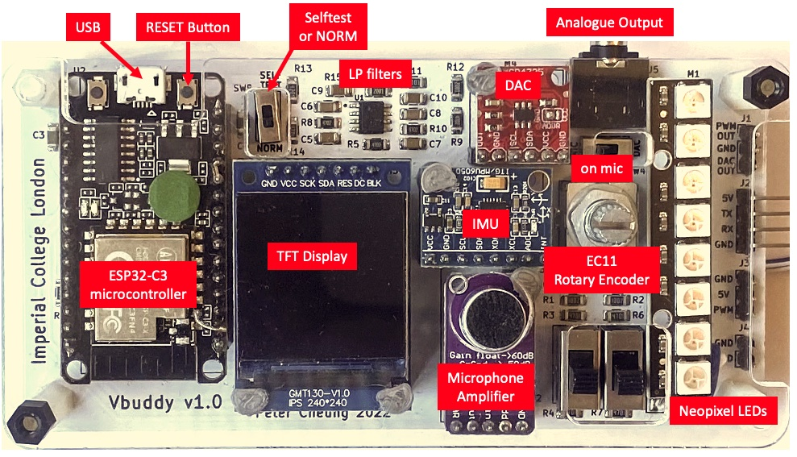
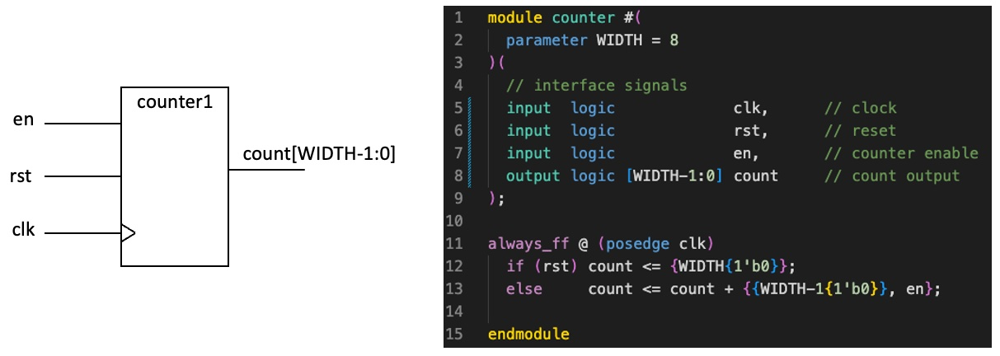
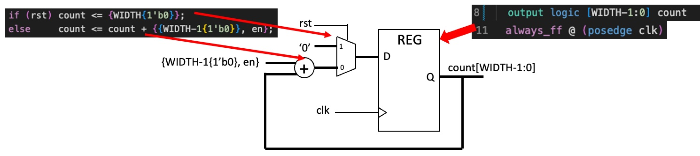
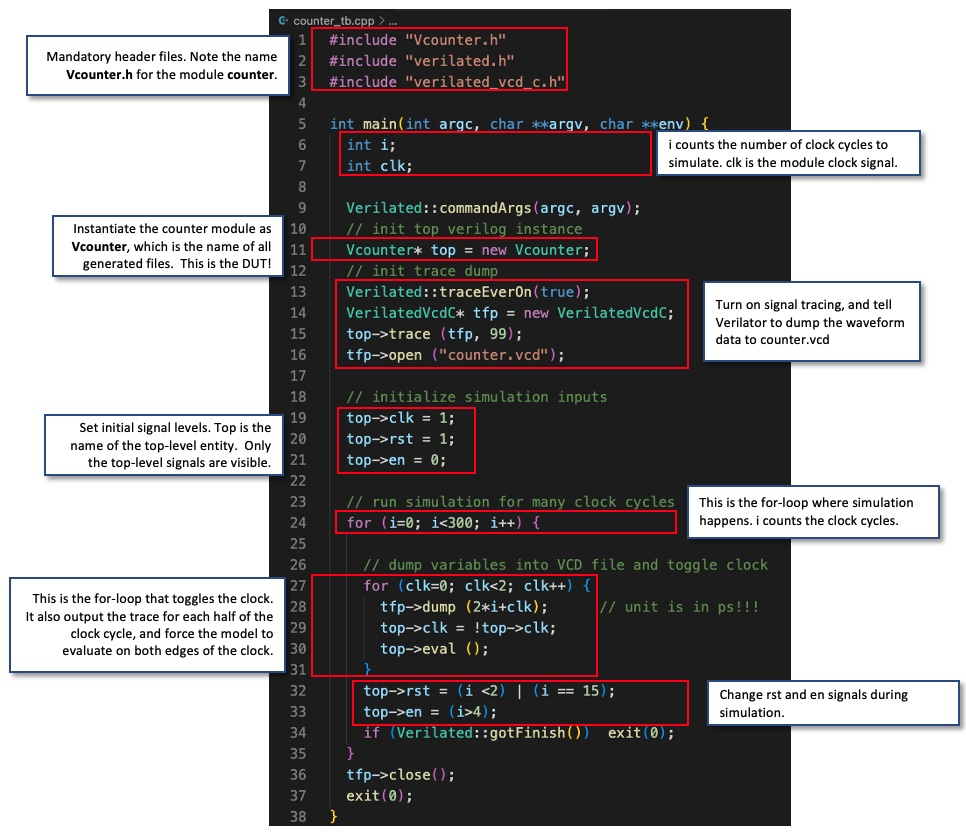
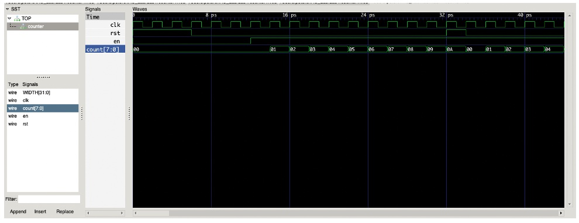
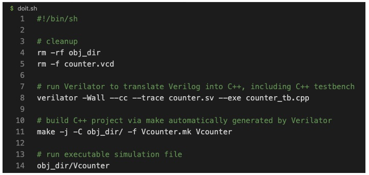
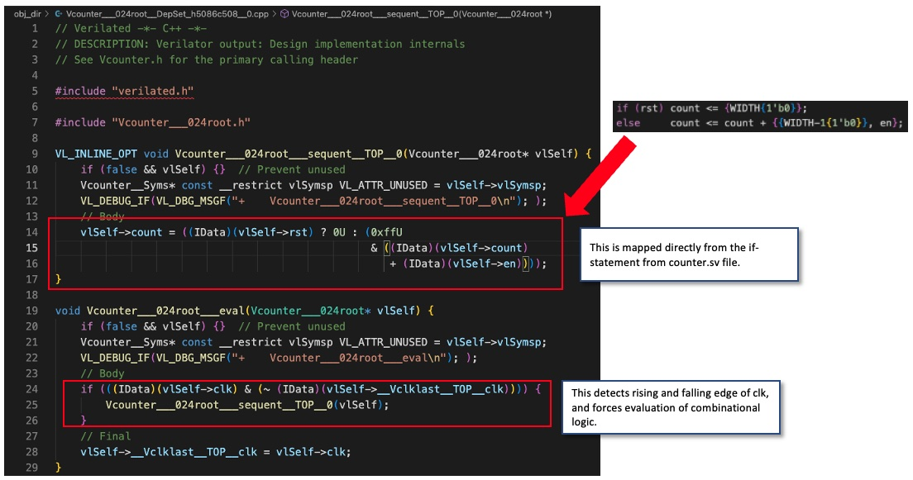
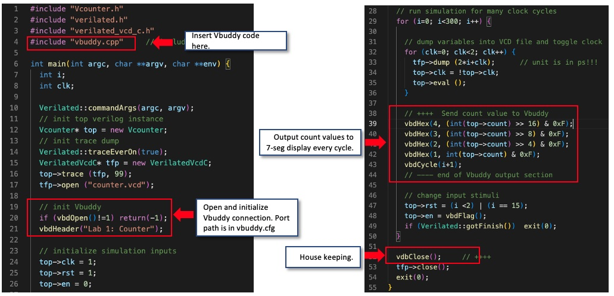

#### Department of Electrical & Electronic Engineering, Imperial College London


### EIE 2 Instruction Set Architecture & Compiler (IAC)
---


## Lab 1 – Learning System Verilog with Verilator and Vbuddy
##### *Peter Cheung, v1.2 - 28 Oct 2022*

---
## Objectives
---
By the end of this experiment, you should be able to:
* write a basic **System Verilog module** for a binary counter
* write a basic **testbench** in C++ to verify the counter is working
* make an executable model of the counter and testbench using **Verilator**
* understand how the counter hardware is **mapped to C++ model**
* use **GTKwave** to examine the waveforms
* use the **Vbuddy board** to display outputs from the simulation model
* design a **programmable up/down counter** with different incremental steps
* single step the counter using the rotary encoder switch on Vbuddy
* implement in System Verilog a circuit to translate a binary number to a BCD number (optional)


## Pre-requisites
---

Before you start this Lab Session, you should have completed [Lab 0](https://github.com/EIE2-IAC-Labs/Lab0-devtools "Tool setup") at home on your laptop.  This means that you have the following packages installed and have verified that they are working properly:
* Microsoft VS Code
* VS Code extensions for System Verilog, C++, Verilog, Markdown
* Git and Github
* Verilator
* GTKwave
* GNU toolchain

You should create a Github account. I will be putting on github all my lab instructions and other supporting materials. You are also expected to keep your work for this module on github.  If you do not already know how to use git and github, and watch the youtube video introducing how to use git and github.

## What is System Verilog?
---
System Verilog is a hardware description and verification language (HDL) mostly for designing digital hardware. It is based on Verilog, the original language introduced in 2002 with improvement that helps verification.  System Verilog is a superset of Verilog that is particularly suitable for register-transfer level (RTL) design.   It also includes object-oriented programming constructs that are dedicated to verification but are not synthesizable.  System Verilog is now the most commonly used language for specifying and designing digital integrated circuits, including microprocessors such as RISC-V.


## What is Verilator?
Verilator is software package to simulate Verilog/System Verilog designs. It differs fundamentally from other commercial simulators such as Modelsim, Synopsys VCS, iCarus etc. in approach. Most other simulators use a method known as “event-driven” simulation.  Every change in an input signal, an event is created in an event queue.  Such event causes other signals to change states, and more events are generated.  All events are propagated and evaluated through the circuit model until no events remains in the queue.  The advantage of this approach is that we can model timing through each gate or flip-flop, and signal levels can take on various signal states (not only ‘0’ and ‘1’).

Verilator instead is a cycle-accurate simulator, which means that circuits states are only evaluated once in a clock cycle.  It does not evaluate time within a clock cycle and is therefore only suitable for functional verification without timing information.  For example, Verilator cannot evaluate glitches in a circuit. Furthermore, Verilator signals can only be true (1) or false (0).  It cannot be unknown, high impedance, floating or in other signal states.

So why use Verilator? Most modern digital circuits are synchronous, i.e. driven by a clock signal controlling registers with combination circuits in between.  If we care about the functionality of the circuit at register transfer level (RTL) only, Verilog is much faster than event-driven simulators.  Verilator only accepts synthesizable Verilog/System Verilog code. Therefore, a Verilator verified design is almost guaranteed to be synthesizable by modern logic synthesis tools.  Finally, Verilator is free and open-source – great for educational users.

## Why is Verilator so fast?
---
The reason why Verilator is so fast is fundamentally because it translates Verilog/System Verilog into C++ (or System C) code. Then it uses standard, highly efficient C++ compiler to produce natively executable “model” or program of the design (known as Device-Under-Test or DUT).  Simulation happens when you run (or execute) this program, just like any other C++ application that you compiled!

## What is a Verilator testbench?
---
One disadvantage of translating a Verilog design into C++ executable is that you normally cannot interact with your simulator.  Say, the executable program produced by Verilator is called “Vcounter”, then simulation is done running by running Vcounter itself.  To know if Vcounter (the Device Under Test or DUT) is working, you have to write a “wrapper” program that instantiate the DUT, provide input signals at the correct time, and display or compare the output signals.  The wrapper program is known as a testbench for the DUT.  When producing the executable model of the counter, it must include the DUT as well as the testbench code.

## What is Vbuddy?
Normally using Verilator to simulate a digital circuit makes the entire process rather like software development – you compile a program, then run it!  There is no easy way of interacting with the model of the DUT.  For example, when simulating a counter, you cannot use the simulation model to drive a physical 7-segment display.   The lack of connection between software simulation and physical hardware makes the entire process of learning digital design artificial.  For this reason, *Vbuddy* was created to provide a bridge between the Verilator simulator and actual physical electronics such as microphone signal and 7-segment displays.



Vbuddy is so named because it is a companion (or buddy) to Verilator, Verilog and RISC-V. It consists of an ESP-C3 RISC-V microcontroller, a 240x240 TFT colour display, a rotary encoder (EC11), a microphone with an autogain amplifier (MAX9814), an Inertia Measure Unit (MPU6050), a 12-bit DAC converter (MCP4725) and two channel lowpass filter.  You will be using Vbuddy throughout the practical sessions of this module in the Autumn term.

______
## Task1 - Simulating a basic 8-bit binary counter

**Step 1: Create a folder for Lab 1** on your local disk for this Lab Session.

The easiest way to achieve this is to "fork" **this github repository** (repo) to your github account, then clone a copy to your local disk.

If you do not already have a github account, you need to create one. Now you need to the repo for Lab 1 (Lab1-Counter)  to your personal github account, and then CLONE it onto your local disk. After successfuly clone the the Lab 1 repo to your disk, you will find a folder called Lab1-Counter.  This is your personal folder for Lab 1. You can add files to it and push them back to your github repo under your github account.

**Step 2:** Run VS Code and open the Lab1-Counter folder with:

*File -> Open Folder* (then select the Lab1-Counter folder)

**Step 3:** Create a new System Verilog file (counter.sv), and enter the code shown on the right. You should include all the comments for future reference.  Colour highlight is automatic if you have installed the System Verilog package for VSC. The schematic representation of this basic counter is shown below. It counts on the positive edge of clk if enable is ‘1’.  It is synchronously reset to 0 if rst is asserted.  Save this file as counter.sv.



Note the following:
1.	The file name and the module name must be the same.
2.	The number of bits in the counter is specified with the parameter WIDTH. It is currently set to 8-bit.
3.	The always_ff @ (posedge clk) is the way that one specifies a clocked circuit.
4.	‘<=’ in line 12 and 13 are non-block assignments which should be used within an always_ff block.
5.	{WIDTH{1’b0}} in line 12 uses the concatenation operator { } to form WIDTH bits of ‘0’. (Can you explain the construct in line 13?)

Here is the mapping between System Verilog and the counter circuit "synthesized" via Verilator:



**Step 4:** Create the testbench file **_counter_tb.cpp_** in C++ using VS Code.

We need to do this before we can combine everything to make the executable model.  The listing for **_counter_tb.cpp_** is shown below.  Again, you are required to type this in (instead of copying) to make sure that you think about each line of this program.

This testbench file is a template for all other testbench files. It consists of various sections, which are mandatory (except for the trace dump section if you don’t want to see the waveforms).  Make sure that you understand what each section is for!



**Step 5: Compile the System Verilog model with the testbench**

Open a terminal window and enter the following command:

```bash
# run Verilator to translate Verilog into C++, including C++ testbench
verilator -Wall --cc --trace counter.sv --exe counter_tb.cpp
```
This runs Verilator to translate counter.sv into C++ code, and merge with **_counter_tb.cpp_** to produces a number of files in a new folder: **obj_dir**. It also automatically generates a **_.mk_** file called **_Vcounter.mk_**, which will produce the final simulation model **_Vcounter_**.

Next enter:

```bash
# build C++ project via make automatically generated by Verilator
make -j -C obj_dir/ -f Vcounter.mk Vcounter
```

This makes **_Vcounter_**, which is the executable model of our counter!

We are now ready to simulate by simply running **_Vcounter_**, which is again in the **_obj_dir/._** directory, by entering:

```bash
# run executable simulation file
obj_dir/Vcounter
```
This runs very fast, and you may think that nothing happened.  However, if you examine the folder task1, you will see a file **_Vcounter.vcd_** has been generated.  This is the trace waveform file and contains the simulation results.

**Step 6:**  Plot the counter waveforms with GTKwave:

Start the GTKwave program on your laptop. Select *File -> Open New Tab* and select **_Vcounter.vcd_** file.  A GTKwave window will appear.  Click *Top -> counter*, followed by the signals: **_clk, rst, en_** and **_count[7:0]_**.
Use the + and - icons to adjust the zoom level.  You should see the following.



Make sure you understand all waveform signals.

Why is the time axis in ps? Does it matter?

Congratulations! You have successfully simulated your first System Verilog digital hardware module.


## Shortcut
To avoid retyping all the commands to make the executable model, create a shell script doit.sh that contains the following lines:

You can now run all the commands in one go by typing:



You can now run all the commands in one go by typing:
```bash
source ./doit.sh
```

Alternatively, you can change the permission of **_doit.sh_** to executable with the **_chmod +x doit.sh_** command, and simply type

```bash
./doit.sh
```
to run the script

## Deep Dive

Verilator produces the executable model **_obj_dir/Vcounter_** and the trace waveform file  **_./counter.vcd_**.  In addition, there are many other files in the **_obj_dir_** directory.  Details of what these files contains can be found on: https://verilator.org/guide/latest/files.html.

Explore what files are created by Verilator in **_obj_dir/ _** and now open in VS code the file: **_Vcounter__024root_....._0.cpp_**.



## TEST YOURSELF CHALLENGES:
1.	Modify the testbench so that you stop counting for 3 cycles once the counter reaches 0x9, and then resume counting.  You may also need to change the stimulus for _rst_.
2.	The current counter has a synchronous reset. To implement asynchronous reset, you can change line 11 of counter.sv to detect change in _rst_ signal.  (See notes.)

Make these modification, compile, and run.  Examine the waveform with GTKwave and explain what you see.

---

## Task 2: Linking Verilator simulation with Vbuddy
---

In this task, you will learn how to modify the testbench to interface with the Vbuddy board.  Before you start, copy  **_counter.sv_** and **_counter_tb.cpp_** to the task2 folder.

You also need to make a copy of the files **_Vbuddy.cpp_** and **_Vbuddy.cfg_** from your Lab 1 folder to here.

**Step 1: Set up the Vbuddy interface**

Connect Vbuddy to your computer's USB port using a USB cable provided.  Find out the name of the USB device used.  How? This depends on whether you are using a MacBook or a PC.

---

**_Macbook Users_**
For Mac users, enter:
```bash
ls /dev/tty.u*
```
You should see a device name similar to this:
```bash
/dev/tty.usbserial-110
```

---

**_Window Users_**
For Windows users, run the following script:
```bash
~/Documents/iac/lab0-devtools/tools/attach_usb.sh
```
This uses usbipd to search for the USB port that Vbuddy is connected to and share it with WSL. The script must be run every time Vbuddy is reconnected to the computer. You may wish to include this in your `doit.sh` script so that it runs automatically every time you run your code.

Next enter the following command to find the name of your device:
```bash
ls /dev/ttyU*
```
You should see a device name similar to this:
```bash
/dev/ttyUSB0
```

---

Create a file: **_vbuddy.cfg_**, which contains the device name as the only line (terminated with CR).  You may use VS Code or the Linux nano editor to do this. You should only have to do this once, as the device name will usually be the same when Vbuddy is reconnected.

**Step 2: Modify testbench for Vbuddy**

Copy **_counter.sv_** and **_count_tb.cpp_** to your task2 folder.

Modify the testbench file  **_count_tb.cpp_**  to include **Vbuddy function** as shown in the diagram below.  What they do are self-explanatory.  You can find a list of the current Vbuddy functions which you can include in the testbench file here.  These functions are of the form **_vbdXxxx_**.



Recompile and test.

**Step 3: Explore flag feature on Vbuddy**

Vbuddy’s rotary encode has a push-button switch.  Vbuddy keeps an internal flag which, by default, will toggle between ‘0’ and ‘1’ each time the button is pressed. You can interrogate this toggle switch state with **_vbdFlag();_**, which will return its current state and then toggle.  A little postbox showing the flag state is drawn in the footer of the TFT display.

You can use this feature to enable and disable the counter by modifying line 48 of the testbench with:
```C++
    top->en = vbdFlag();
```

Re-compile and test.

Instead of showing count values on 7-segment displays, you may also plot this on the TFT by replacing the **_vdbHex()_** section with the command **_vbdPlot()_**.  You may want to increase the number of clock cycles to simulate because plotting a dot is much faster than outputting to the 7-segment display.  You can start/stop the counter with the flag.
```C++
    vbdPlot(int(top->count), 0, 255);
```

## TEST YOURSELF CHALLENGE:

Modify your counter and testbench files so that the **_en_** signal controls the direction of counting: ‘1’ for up and ‘0’ for down, via the **_vbdFlag()_** function.

___
WELL DONE!  YOU MANAGE TO SPECIFY AND VERIFY YOUR DESIGN AND USE VBUDDY TO SEE THE RESULTS OF YOUR CIRCUIT.  THE NEXT TWO TASK: TASK3 and TASK4 ARE OPTIONAL. YOU CAN SKIP THEM IF YOU RUN OUT OF TIME.
___

## Task 3: Vbuddy parameter & flag in one-shot mode (OPTIONAL)

The rotary encodes (EC11) provides input from Vbuddy to the Verilator simulation model.  Turning the encoder changes a stored parameter value on Vbuddy independently from the Verilator simulation.  This parameter value can be read using the **_vbdValue( )_** function, and is displayed on the bottom left corner of the TFT screen in both decimal and hexadecimal format.

**Step 1: Loadable counter**

Copy across to the task3 foler the required files: **_counter_tb.cpp, vbuddy.cpp, doit.sh_** and **_vbuddy.cfg_**, but not **_counter.sv_**. Instead use a modified version of **_counter.sv_** shown below.  This version replaces the enable signal **_en_** with a load signal **_ld_**. When **_ld_** is asserted, the value **_v_** is loaded into the counter as a pre-set value.

```verilog
module counter #(
  parameter WIDTH = 8
)(
  // interface signals
  input  logic             clk,      // clock
  input  logic             rst,      // reset
  input  logic             ld,       // load counter from data
  input  logic [WIDTH-1:0] v,        // value to preload
  output logic [WIDTH-1:0] count     // count output
);

always_ff @ (posedge clk)
  if (rst) count <= {WIDTH{1'b0}};
  else     count <= ld ? v : count + {{WIDTH-1{1'b0}},1'b1}
endmodule
```

Vbuddy’s flag register has two modes of operation.  The default mode is **TOGGLE**, which means that everything the rotary encoder switch is pressed, the flag will toggle as indicated at the bottom of the TFT screen.

However, using the **_vbdSetMode(1)_** function, you can set the mode to ONE-SHOT behaviour. Whenever the switch is pressed, the flag register is set to ‘1’ as before – now the flag is **“ARMED”** ready to fire. However, when the flag register is read, it immediate resets to ‘0’.

Modify **counter.sv** so that pressing the switch on EC11 forces the counter to pre-set to Vbuddy’s parameter value. (How?)  Compile and test your design.

**Step 2: Single stepping**

Using the one-shot behaviour of the Vbuddy flag, it is possible to provide one clock pulse each time you press the rotary encoder switch.  In other words, you can single step the counting action.

Modify **counter.sv** so that you only increment the counter each time you press the switch.


---

## Task 4: Displaying count as Binary Coded Decimal (BCD) numbers (OPTIONAL)
---

So far, you have only simulated a single module.  In this task, you will create a top-level module (**top.sv**), which has the counter module, and a second module that converts the 8-bit binary number into three BCD digits. You can find out how the binary to BCD conversion algorithm works from the course webpage.

Copy and paste the following code to **top.sv**:

```verilog
module top #(
  parameter WIDTH = 8
)(
  // interface signals
  input  logic             clk,      // clock
  input  logic             rst,      // reset
  input  logic             en,       // enable
  input  logic [WIDTH-1:0] v,        // value to preload
  output logic [11:0]      bcd       // count output
);

  logic  [WIDTH-1:0]       count;    // interconnect wire

counter myCounter (
  .clk (clk),
  .rst (rst),
  .en (en),
  .count (count)
);

bin2bcd myDecoder (
  .x (count),
  .BCD (bcd)
);

endmodule
```
Modify the **_doit.sh_** file from task 3 to include all the modules (**_top.sv, counter.sv, bin2bcd.sv_** and **_top_tb.cpp_**).  Compile and run the Verilated model.  Check that it works according to expectation.

Note that **top_tb.cpp** is just **counter_tb.cpp** copied over.
